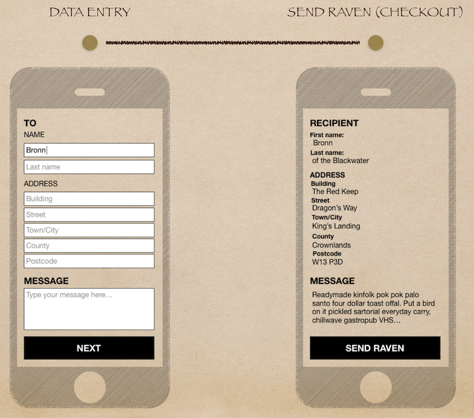

# An Api of Ice and Fire

The purpose of the project is to show a few different forms an API can take
as you evolve it from monolith to microservices.

To take it closer to a real-life situation, it has been evolved around an imaginary
"Raven dispatching service" that helps our characters in Game of Thrones to order 
ravens through a simple mobile app.

At the moment the api only supports get-requests and is designed around the
resources needed to display a "raven checkout page".




## Running the project

### Dependencies
- [Node](https://nodejs.org/en/) - version 8.4+
- [Postman](https://www.getpostman.com/) - if you want to use the pre-canned queries

### Run
```bash
git checkout <tag of stage you want to run>
npm start --port <port you want to run to, default to 5000>
``` 

### Using postman
To use the pre-canned queries included in the /postman folder:

```
Download Postman 
Open Postman
Import folder "/postman"
Use queries
```

## API stages

### Monolith
In this stage of the api it only has one resource - message

```
git checkout monolith
npm start --port 10000 (port only important if you want to use postman)
```

### Monolith with parallell resources
A monolith api with two resources - message and contact.

```
git checkout monolith-parallell-resources
npm start --port 11000
```

### Decoupled monolith using Hypermedia
A decoupled api with three resources - message, contact and address.
At this point we have a decoupled api that is easy to split into microservices.
However, we need to do three requests instead of one to display the checkout
screen.

```
git checkout decoupled-monolith
npm start --port 13000
```

### Decoupled monolith using Hypermedia and GraphQL
A decoupled api with three resources - message, contact and address. GraphQL
is used to render the contact and address resources onto the message response.

```
git checkout decoupled-monolith
npm start --port 13000
```

 